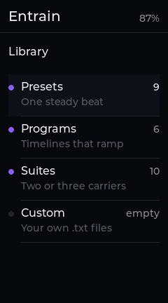
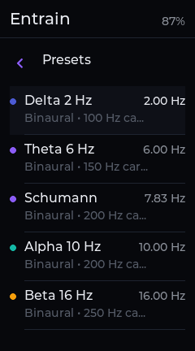
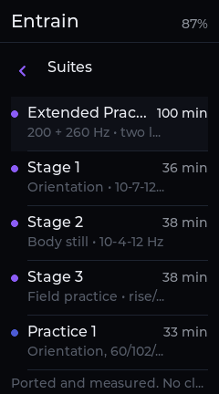
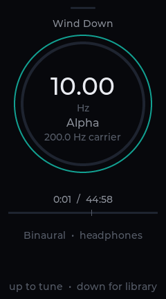
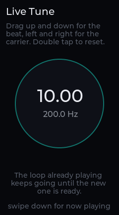
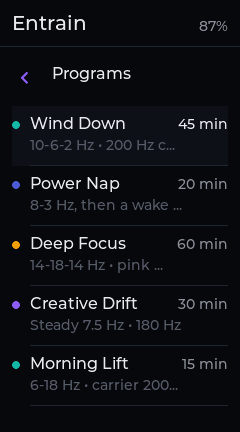
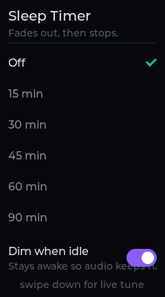
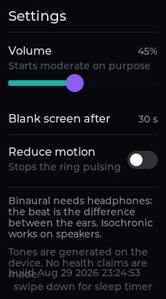
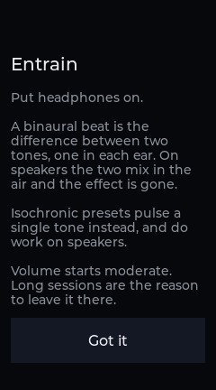

# Entrain

Binaural, isochronic and monaural tone generation on the iPod nano 7G. Tones
are synthesised on the device, not shipped as audio files: a preset is a
handful of numbers, and the app renders a cycle-exact seamless loop from them
at play time.

Entrain describes what it produces — frequencies, carriers, waveforms — and
nothing else. See [No claims](#no-claims).

## Screenshots

| | | |
| --- | --- | --- |
|  |  |  |
| Library — four shelves | Presets | Suites |
|  |  |  |
| Now Playing | Live Tune | Programs |
|  |  |  |
| Sleep Timer | Settings | First run |

These are rendered from the host build at the device's exact 240x432, with
`cd host && make -f Makefile.host shots` — no display or window manager required.

## What it does

- **Three modes.** *Binaural* puts a different frequency in each ear; the beat
  exists only in the listener, and headphones are required. *Isochronic* gates
  a single carrier at the beat rate, so the modulation is in the signal and
  survives speakers. *Monaural* puts both tones in both ears.
- **Nine presets** across the Delta, Theta, Alpha, Beta and Gamma bands, plus
  a 7.83 Hz Schumann preset. Every one realises its requested beat exactly —
  see the table below.
- **Six programs**: timelines that ramp the beat over 15 to 60 minutes.
- **Ten suites**: longer sessions that sound up to five carriers at once, each
  layer with its own beat and gain envelope. Four are ported from a generator's
  own metadata; six are measured from recordings.
- **A library you can browse.** Four shelves — Presets, Programs, Suites,
  Custom — rather than three tabs across the top, which had run out of room.
- **Noise beds**: white, pink (Kellett 3-pole) or brown, mixable under the
  tones with their own level.
- **Live Tune**: drag to move the beat and carrier while the current loop keeps
  playing. The device re-renders in the background; there is never a silent gap.
- **Sleep timer** with a fade-out, and a screen-blank mode that kills the
  backlight while audio keeps running.
- **User programs** loaded from a plain text file — the format is below.

## Presets

Every preset is planned to a *cycle-exact* loop: a whole number of cycles of
both carriers inside the loop, so the wrap point is indistinguishable from any
other sample transition. The realised beat is what the app displays and what
these numbers report.

| Preset | Band | Requested | **Realised beat** | f_L / f_R | Loop | Size |
| --- | --- | --- | --- | --- | --- | --- |
| Delta 2 Hz | Delta | 2 Hz | **2.000000 Hz** | 100.00 / 102.00 Hz | 17.000 s | 750 KB |
| Theta 6 Hz | Theta | 6 Hz | **6.000000 Hz** | 150.00 / 156.00 Hz | 17.667 s | 779 KB |
| Schumann | Theta | 7.83 Hz | **7.830000 Hz** | 199.98 / 207.81 Hz | 11.111 s | 490 KB |
| Alpha 10 Hz | Alpha | 10 Hz | **10.000000 Hz** | 200.00 / 210.00 Hz | 17.800 s | 785 KB |
| Beta 16 Hz | Beta | 16 Hz | **16.000000 Hz** | 250.00 / 266.00 Hz | 17.000 s | 750 KB |
| Gamma 40 Hz | Gamma | 40 Hz | **40.000000 Hz** | 300.00 / 340.00 Hz | 17.800 s | 785 KB |
| Alpha + Pink | Alpha | 10 Hz | **10.000000 Hz** | 200.00 / 210.00 Hz | 17.800 s | 785 KB |
| Theta Speaker | Theta | 6 Hz | **6.000000 Hz** | 150.00 Hz gated | 17.667 s | 779 KB |
| Delta Brown | Delta | 2 Hz | **2.000000 Hz** | 100.00 / 102.00 Hz | 17.000 s | 750 KB |

All at 11025 Hz, 16-bit stereo. `./build/entrain-wav --list` regenerates this
table from the code.

### Why 11025 Hz, and why the carrier moves

The OS sound loader refuses any file over 1 MiB. That is a hard constant in the
firmware, not a guess — see [AUDIO_NOTES.md](AUDIO_NOTES.md), which cites the
instruction that enforces it. It bounds how long a loop can be:

| Sample rate | Max loop in 1 MiB | Nyquist |
| --- | --- | --- |
| 44100 Hz | 5.94 s | 22.05 kHz |
| 22050 Hz | 11.89 s | 11.02 kHz |
| **11025 Hz** | **23.78 s** | **5.51 kHz** |

Carriers live between 100 and 400 Hz and the renderer emits pure sines, so
11025 Hz has better than an order of magnitude of headroom over anything in the
signal. Dropping the rate costs nothing audible and quadruples the loop length,
which is what makes an exact 7.83 Hz beat fit at all.

Given a rate, the loop planner picks the number of samples `N` and the whole
cycle counts. The rule it follows:

> **The beat is the point of the preset — never move it. The carrier is
> arbitrary within a wide range — move that instead. Then display the realised
> beat, not the requested one.**

For Schumann that gives `N = 122500` at 11025 Hz, or exactly `100/9` seconds:
2222 cycles of the left carrier (199.98 Hz) and 2309 of the right (207.81 Hz),
a difference of 87 cycles in `100/9` s — **7.830000000 Hz, exactly**, in 490 KB.
The carrier moved by two hundredths of a hertz, which nobody can hear. The beat
did not move at all.

## Programs

| Program | Band | Length | What it does |
| --- | --- | --- | --- |
| Wind Down | Alpha | 45 min | 10 Hz to 6 Hz to 2 Hz, 200 Hz carrier |
| Power Nap | Delta | 20 min | 8 Hz to 3 Hz, then a 2 min ramp to 12 Hz |
| Deep Focus | Beta | 60 min | 14-18-14 Hz, 250 Hz carrier, pink noise bed |
| Creative Drift | Theta | 30 min | Steady 7.5 Hz, 180 Hz carrier |
| Morning Lift | Alpha | 15 min | 6 Hz to 18 Hz, carrier 200 to 260 Hz |
| Meditation Descent | Alpha | 30 min | 11 Hz to 5.5 Hz, long fades |

A program is a chain of segments rendered through one renderer, so its
oscillator phases carry across every join and the beat never jumps.

These six glide linearly between their breakpoints, which is what they were
written against. The suites below use smoothstep instead, per segment.

## Suites

Four longer sessions that sound **more than one carrier at once**. A segment
can carry up to four layers, each with its own mode, beat and gain envelope,
mixed over one shared noise bed.

Listed in the app as **Extended Practice**, **Stage 1**, **Stage 2** and
**Stage 3**; the descriptions below are what each one's detail line says.

| Suite | Length | Layers | Shape |
| --- | --- | --- | --- |
| Extended Practice | 100 min | 200 Hz + 260 Hz | 10-7-4 Hz descent, a layered 4 Hz block with a steady 7 Hz above it, then a return to 12 Hz |
| Stage 1 (Orientation) | 36 min | 300 / 104 / 496 Hz | Settle at 10 Hz, ease to 7 Hz, hold, return to 12 Hz |
| Stage 2 (Body Still) | 38 min | 300 / 104 / 496 Hz | 10 Hz down to a sustained 4 Hz, then out |
| Stage 3 (Field Practice) | 38 min | 300 / 104 / 496 Hz | As stage 2, then rise and settle three times |

### Six more, measured rather than read

The first four above come from a generator's own metadata. Six others —
**Practice 1** through **Practice 6** — were measured from recordings, because
no schedule for them existed in any form.

`tools/analyse-layers.py` decodes through ffmpeg at 4 kHz, then per eight-second
window and per carrier band takes the strongest peak in each channel, pairs
them, and reports the carrier, the beat between the ears and how present that
band is. `tools/port-measured.py` bins that into segments and emits the C table
in `core/measured.c`.

What crosses over is a measurement: frequencies, differences and timings, four
seconds apart. Nothing of the recordings is retained and Entrain synthesises
its own tones. The names are deliberately not the originals — see
[Trademark](#trademark).

Two things the measurement had to get right, both of which were wrong first:

- **Pairing.** Searching each channel independently across the whole band had
  the left ear lock to the 300 Hz family and the right to the 102 Hz one, and
  reported a 190 Hz "beat". A beat is the difference between two tones that are
  nearly the same, so the partner is searched for within 25 Hz of the first.
- **Bands.** 96–126 Hz was one band to begin with, which straddles two
  different tones — the ~102 Hz signal and the ~114/119 Hz reference — so it
  reported a carrier jumping between them. Each band has to hold one stable
  carrier to mean anything.

Every band that actually sounds becomes a layer, including through the
stretches where its gain is zero. A layer that goes quiet for ten minutes and
comes back is what the recording does. Nothing is dropped to fit a layer count:
`EN_MAX_LAYERS` is sized to the material, not the other way round.

### Where the first four come from

The **schedule** is ported — beat breakpoints, layer carriers, per-phase gains
— read out of the generators' own metadata in a research archive of original
synthesised practice audio. No recording was decoded, sampled or reproduced,
and no third-party audio is involved. The stage names are the archive's own,
chosen there to be neutral, and they are used here unchanged. As everywhere
else in this app, no effect of any kind is claimed. See
[No claims](#no-claims) and [Trademark](#trademark).

### Two conventions the port keeps

**Levels are normalised to the main carrier.** The archive works in absolute
peak amplitude — 0.070 for a main carrier, 0.045 and 0.018 for the others,
about -23 dBFS — which is right for a mastered hundred-minute file and twenty
decibels below everything else in this library. Normalising preserves the
balance between layers exactly while letting the segment's master gain put the
mix where the rest of the app sits. The one relationship a listener would
notice, the 13.7 dB between the two layers of Extended Practice, is asserted by
a test against the rendered PCM.

**Glides are smoothstep.** These are chains of holds and glides, and a linear
glide arriving at a hold has a corner in it — over a forty-minute descent that
corner is the moment you notice.

Layer gains are absolute and **sum**; nothing normalises them at render time,
because normalising a mix whose balance is the point of it would silently
rescale exactly what was ported. A test checks every segment of every suite
stays under full scale once the master gain and headroom are applied.

## User programs

Drop a `.txt` file into `/Apps/Data/Entrain/programs` on the device (or
`~/.entrain/programs` on the host) and it appears under **Custom**.

```
# Lines starting with # are ignored, as are blank ones.

name    Evening Slide          # shown in the library
mode    isochronic             # binaural | isochronic | monaural
carrier 180                    # Hz, 20 to 1000
noise   pink 0.2               # none | white | pink | brown, then 0..1 level

seg     10  6    900           # beat_from  beat_to  seconds
seg     6   2.5  1200
```

- `seg` is the only required line. Everything else has a default
  (`binaural`, 200 Hz, no noise, `Untitled`).
- `carrier` and `noise` apply to the `seg` lines **after** them, so a program
  can change carrier or noise bed partway through by repeating them.
- Up to 16 segments. Beats from 0.5 to 100 Hz.
- A malformed file is rejected with the offending line number rather than
  half-loaded.

## Building

### For the iPod

From the repo root, with the toolchain set up per the main README:

```bash
./start build entrain
```

```bash
./start install entrain
```

The app appears on the Home Screen as **Entrain**. Rendered loops are cached
under `/Apps/Data/Entrain/cache`, keyed by their realised parameters, so
playing a preset a second time starts immediately.

### On a Linux desktop

`core/` is pure C99 with no LVGL and no SDK includes, and `ui.c` is the same
file the device compiles, at the same 240x432. So the whole app runs on a
desktop, and the layout you see there is the layout the device renders.

```bash
cd apps/entrain/host && make -f Makefile.host test
```

```bash
cd apps/entrain/host && make -f Makefile.host run
```

`run` opens a 240x432 SDL window. Other backends, for a real panel:

```bash
./build/entrain-host --backend fbdev --fbdev /dev/fb0 --evdev /dev/input/event0
```

```bash
./build/entrain-host --backend drm --drm /dev/dri/card0 --evdev /dev/input/event0
```

SDL2, ALSA and libdrm are each optional and detected by the Makefile. Without
SDL you still get fbdev, DRM and headless; without ALSA the UI runs silently.

To regenerate the screenshots with no display at all:

```bash
cd apps/entrain/host && make -f Makefile.host shots
```

### Listening to the DSP

```bash
cd apps/entrain/host && make -f Makefile.host wav && ./build/entrain-wav --list
```

```bash
./build/entrain-wav --preset 2 -o schumann.wav
```

A `--preset` render is the exact loop the device would play, byte for byte, so
it doubles as a way to check a preset on real speakers or to drop onto the iPod
directly. `--program N --minutes M` renders a timeline; `--beat`/`--carrier`/
`--mode`/`--noise` render anything ad hoc.

## Tests

```bash
cd apps/entrain/host && make -f Makefile.host test
```

770 checks, plus a source lint. The two that matter most:

- **The click test** renders a chain of segments whose beat *and* carrier both
  move at every join, then asserts that the sample step across each join is no
  larger than the steepest step inside the segments. A click at a join is the
  one artefact that makes this kind of app feel broken, and it is exactly the
  bug that creeps back in when someone resets a phase.
- **The loop-seam test** renders every shipped preset and asserts the same
  thing about the wrap from the last sample to the first, plus that two renders
  of one preset are byte-identical — otherwise the render cache key would be
  lying.

Also covered: beat accuracy within 0.01 Hz measured by interpolated zero
crossings, phase continuity across a parameter glide, oscillator drift, the
loop planner's budget and exactness, fades reaching true silence, the soft
clipper's bounds and monotonicity, the WAV header, and the user-program parser
including every malformed case.

`make test` also runs `check_glyphs.py`, which fails the build if any
user-facing string contains a character LVGL's Montserrat does not carry. That
font is ASCII plus a small symbol set; anything else renders as an empty box,
and an em dash in a settings note is exactly how that gets shipped.

## How it is put together

```
entrain.c            device entry: buttons, wake lock, lifecycle
ui.c                 every screen — shared verbatim by both targets
engine.c             what to render, when, and what to hand the backend
core/                pure C99. No LVGL, no SDK, no libc beyond the freestanding
  osc.c                headers. This is what makes the host tests possible.
  noise.c
  render.c
  program.c          bands, presets, programs, the loop planner, the parser
  wavout.c
platform/
  audio.h            "here is a seamless loop; play it until I say otherwise"
  audio_device.c     hb_audio backend: WAV cache, timed re-arm
  audio_host.c       ALSA streaming backend
  sys.h / sys_*.c    battery, backlight, prefs, files
host/
  main_host.c        SDL / fbdev / DRM / headless bring-up at 240x432
  tests.c
  wavtool.c
AUDIO_NOTES.md       what the OS audio path can and cannot do, and how we know
```

`core/` having no dependencies is not tidiness for its own sake: it is why the
DSP can be unit-tested and listened to on a desktop instead of inferred from a
device that can only report through a 240 px screen.

## Known limitations

- **Stopping is not immediate on the device.** No stop primitive has been found
  in the OS sound player, so `stop` stops re-arming and lets the current buffer
  finish — up to one loop length, 11 to 18 seconds. The sleep timer's fade
  therefore lands at a loop boundary rather than exactly on the second. Finding
  a stop primitive is the top follow-up in [AUDIO_NOTES.md](AUDIO_NOTES.md).
- **Phase 0 is partly unverified on hardware.** Most of what the app assumes
  about the audio path was established by disassembling RetailOS 1.1.2 rather
  than by running on a device. `harnesses/audio_spike` exists to confirm or
  refute it and lists its predictions; AUDIO_NOTES.md marks every claim with
  how it was established.
- **The type scale is 36/20/16/14, not the 34/22/16/13** the design called for.
  The device's LVGL config ships those four Montserrat faces; adding two more
  would grow every LVGL app in the repo, not just this one.
- **Numerals are not tabular.** LVGL's Montserrat is proportional, so readouts
  sit in fixed-width containers instead — the block does not shift, even though
  the glyphs are not strictly monospaced.

## Safety and scope

### Headphones

Binaural presets need headphones. The beat is the difference between what each
ear receives; on speakers the two tones mix in the air before they reach you
and there is no difference left. The app says so on first run. Isochronic mode
gates a single tone instead and does work on speakers.

### Photosensitivity

A full-screen element flashing between roughly 8 and 30 Hz is a genuine seizure
risk, and several bands sit squarely in that range. So:

- only the ring pulses — never the background, never the whole screen;
- the modulation is shallow: about 12% opacity and 3 px on a 180 px ring;
- the pulse rate is **halved until it is under 4 Hz**, staying phase-locked to
  the beat, so a 40 Hz preset breathes at 2.5 Hz rather than strobing;
- **Reduce Motion** in Settings stops the pulse entirely.

### Volume

Volume defaults to 45% and is capped below maximum. Sustained listening at high
SPL is the actual hazard with this kind of audio, and a tone that is easy to
ignore is easy to leave too loud for an hour.

### No claims

Entrain makes no medical, therapeutic or neurological claims, and none belong
in a pull request against it. Presets and programs are described by what they
technically are — "10 Hz binaural beat, 200 Hz carrier" — never by what they
allegedly cause. Band names (Delta, Theta, Alpha, Beta, Gamma) are used as the
conventional labels for frequency ranges and nothing more.

### Trademark

This app is not affiliated with, endorsed by, or derived from The Monroe
Institute. "Hemi-Sync" is their registered trademark and appears nowhere in
this app, its presets, or its documentation except in this sentence explaining
why.

## Licence

MIT, matching the repository. See [LICENSE](../../LICENSE).
