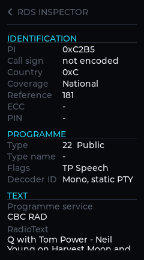
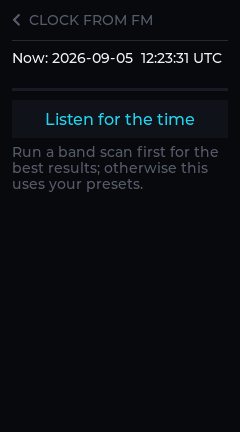
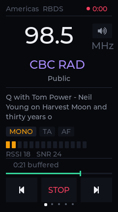

# Radio+

The FM tuner on the iPod nano 7G, with everything the broadcast is already
telling you.

The hardware has had an FM receiver and a full RDS decoder in it since 2012.
RetailOS shows you a frequency. This shows you the station's name, what it is
broadcasting, its programme type, its alternate frequencies, its own clock —
and lets you record any of it, including the part that already happened.

It will also take the whole of RDS apart on screen for you, and set the
device's hardware clock from a broadcaster's time signal, because there is no
network here and the band is right there.

## Screenshots

| | | |
| --- | --- | --- |
|  |  |  |
| **Now Playing** — the station, what it is playing, and the buffer behind it | **Landscape** — radio text the long way round | **Simple** — six buttons, for when you are not reading |
|  |  |  |
| **RDS inspector** — every field the broadcast carries | **Clock from FM** — setting the time off a transmitter | **Recording**, with the live buffer behind it |
|  |  |  |
| **Dial** — the band, with the scan's own measurements under it | **Presets**, named by RDS | **Recordings**, named by when and what |
|  |  |  |
| **Settings** | **Register explorer** — all 39, field by field | **One register** — the stereo blend curve |

All of it rendered from the host build at the device's exact 240×432, with no
display and no hardware:

```bash
cd host && make -f Makefile.preview publish
```

`shots` renders every screen; `publish` copies the subset above into
`screenshots/` under the names this file uses. The rename table lives in the
makefile so the pictures here cannot quietly fall behind the app — which they
had, by three weeks and two screens, before it existed.

## What it does

### The radio

- **Five region plans.** Americas (RBDS, 200 kHz spacing), Europe, Australia,
  Japan (76–95 MHz) and Japan wide (76–108 MHz). The region sets the band, the
  grid and which programme-type table is in force.
- **Seek and step**, on the region's own grid rather than a fixed 100 kHz.
- **A signal meter that is a shape, not a number.** RSSI is reported across the
  full byte but everything real lives in the bottom third, so the scale is
  compressed to where the signal actually is. You can see whether moving the
  headphone cable helped.

### RDS, properly

Group decoding is IEC 62106 and the NRSC RBDS variant, implemented from the
standard and independent of the tuner chip. Decoded and displayed:

| Group | Carries |
| --- | --- |
| 0A / 0B | Programme service name, traffic flags, music/speech, decoder identification, alternate frequencies |
| 1A | Extended country code, programme item number |
| 2A / 2B | Radio text — 64 characters, or 32 in the B variant |
| 4A | Clock time and date, converted from modified Julian day and offset to local |
| 10A | Programme type name, the eight-character refinement of the numeric type |

**RBDS is not a footnote.** North American broadcasters use a completely
different programme-type table, and `I2C_RDS_CTRL` bit 0 selects which the chip
is decoding. Showing "Serious Classical" for a station transmitting "Classical"
would be a small lie; showing "Phone In" for "Public" is a large one.

A programme service name is shown only once every segment has arrived — a
half-filled name reads as a glitch rather than as a station. Radio text clears
on the A/B flag toggle, or the old message shows through the gaps in the new
one.

### The RDS inspector

Settings → **RDS inspector**. Everything the decoder holds, which has always
been considerably more than four lines on Now Playing.


- **PI taken apart.** It is not an opaque number: the top nibble is a country,
  the next is how far the programme reaches, and the bottom byte distinguishes
  programmes within it. A listener sees a station; this is how you see whether
  two frequencies are carrying the same one.
- **The call sign**, where the PI spells one. NRSC-4-B gives K stations the
  range from `0x1000` and W stations the range from `0x54A8`, each exactly
  26³ wide, so the three letters come straight back out by division. Outside
  those two ranges it says so rather than inventing something — Canadian PI
  codes are allocated centrally and do not encode the call at all.
- **The decoder identification bits**, spelled out. Whether the transmission is
  actually stereo, whether it is compressed, whether the programme type is
  being switched dynamically. Four bits, arriving one per group, that nothing
  else in the app was reading.
- **RadioText+ including the interesting failure.** A station that announced
  RT+ in group 3A and transmits nothing in the slot it named is the commonest
  RT+ fault there is, and it looks identical to "no RT+" unless something tells
  you the announcement happened.
- **Every Open Data Application announced**, not only the one this decodes.
  Knowing a station is also running Alert-C in 8A is exactly what this screen
  is for.
- **The group histogram.** All thirty-two types, with counts and proportions —
  what the station actually transmits, as against what it claims. Underneath
  it, the block error rate, in **per mille**: on a good signal a percentage
  rounds to zero and reads as a broken counter.

The tables behind it are `core/rdsname.c`, deliberately separate from
`core/rds.c`. That file has to be right about bits and is tested against
hand-built groups; this one is transcribed from IEC 62106 and NRSC-4-B, where a
wrong string is a cosmetic bug and a wrong shift would be a corrupt decode.
Different risk, different file.

### Setting the clock off the band

Settings → **Set clock from FM**.


This device has no network, no cell radio, and a hardware clock nobody has ever
set, so it boots believing it is some time in 1970 and files every recording
fifty-six years early. There is no NTP to fix that with. There is, however, a
band full of broadcasters transmitting the date and the time as part of their
normal output, usually from the same reference that times the transmitter.

So listen to them, show what each one says, and let the listener pick.

Three things had to be right for this to be a feature rather than a party
trick.

**The instant, not the display.** The decoder's `ct_hour` and `ct_minute` are
local time, which is what a listener should see and the wrong thing to set a
clock from — a hardware clock holding local time is wrong twice a year. So the
decoder also keeps the modified Julian day and the transmitted UTC exactly as
they came off the air, and `en_rds_ct_unix()` turns them into seconds with one
subtraction: MJD 40587 is the Unix epoch, so there is no calendar arithmetic in
the path at all and therefore nothing in it that can be wrong about a leap
year. A test asserts that the same instant transmitted from two time zones
produces the same number.

**The answer has an age.** The specification puts the minute edge at the start
of the group carrying the time, so a station's answer is exact when it lands
and stale immediately afterwards. A reading taken forty seconds ago sets the
clock forty seconds slow, which is a lot to be wrong by when the source was
accurate to the millisecond. Every result is timestamped and the elapsed time
is added back — rounded rather than truncated, because this is the one number
in the app where half a second of systematic bias would accumulate into
hardware. It is also why the list keeps updating while you read it.

**Whose answer it is.** `ct_valid` stays true from the first group onwards and
the decoder belongs to whatever is tuned, so asking "does it have a time?"
after retuning is answered by the *previous* station within a millisecond. Only
the group counter moving means this station spoke. There is a test for exactly
that case, because it is a wrong answer that looks like a very fast right one.

It is its own state machine (`core/ctscan.c`) rather than a mode of the band
scan, and unavoidably slow: group 4A comes about once a minute, where the band
scan leaves each station as soon as the name arrives — usually under a
second — so it would never see one. Candidates come from the last band scan
sorted by signal strength, which is what decides whether this takes thirty
seconds or six minutes; failing that the presets; failing that whatever is
tuned.

Both clocks get set, and they are not the same clock. `settimeofday` fixes the
running system and every timestamp from that moment on; `RTC_SET_TIME` on the
first RTC that opens is what makes it survive a reboot. "Set" and "set until
you reboot" are reported as different outcomes, because they are. UTC in both.

### Recording

- **Record what is playing**, to WAV, with an RDS sidecar beside it.
- **Keep what already happened.** A live ring buffer runs behind the radio —
  30 seconds by default, settable — and **KEEP** writes the whole of it to a
  file. That is the reason a timeshift buffer exists, and it is one button.
- **Scrub back into the buffer** and return to live.
- **Traffic announcements can record themselves**, off by default: a radio that
  starts writing files on its own the first time a station announces traffic is
  a surprise, and a surprise that fills a disk.

Recordings are named by date and station rather than `rec001`, because a
directory of `rec001` is useless a week later.

#### The RDS sidecar

Each recording gets a `name.rds.json` beside it, carrying **raw groups**
alongside the decoded fields. Raw groups mean a recording can be decoded again
later by a better decoder than the one that made it — which matters here
specifically, because the FIFO framing in `core/rds.c` is not yet confirmed and
every recording made before it is confirmed would otherwise be undecodable
afterwards.

It is written streaming — opened, appended to, closed — so an hour-long
recording does not have to be held in memory, and each append is a complete
line that stands on its own if the file is truncated.

### Mute, and a silent scan

The speaker in the corner of the frequency mutes at the tuner's own
`MANUAL_MUTE` bit, through the `FM Tuner Mute` control the machine driver
publishes on the sound card.

The place matters. Muting by closing the capture PCM would also stop the IIS2
clock and take RDS down with it — and RDS is precisely what you want to keep
while the audio is off, because the band scan's naming pass is nothing but RDS.
So a scan runs silent: two hundred channels of hiss on the way to twenty
stations is not something anybody wants to listen to, and the names still
arrive.

The scan's squelch and your mute are separate flags over the same bit in the
chip. A scan that ended by unmuting would have overridden a decision you made
before you started it.

There is deliberately no volume here. No FM volume register appears anywhere in
the recovered `FM_RDS_Command` map; level on this path is the codec's playback
volume once the audio reaches the headphones, which is already a control. A
software gain would be a second volume corresponding to nothing.

### FM into Bluetooth headphones

```bash
RADIOPLUS_PCM_OUT=1,0 radioplus     # write to hw:Loopback,0
```

With `snd-aloop` loaded, that puts the radio where `tinybtd`'s SBC encoder
reads it from `hw:Loopback,1`, and FM comes out of a pair of Bluetooth
headphones. This was assumed for a long time to need audio routing the SoC does
not have; with the encoder in software it is two PCMs and a kernel module, and
was never a hardware limit.

Doing it in the player rather than with an `arecord` pipe off the capture
device keeps the parts that make this app worth using — the live ring, the
scrubbing and the recording all sit between the tuner and that write, and a
pipe bypasses every one of them.

Two things to know before setting it: the loopback takes its rate from
whichever side opens first, so start the encoder end first; and a loopback with
nothing reading it fills and stops, which sounds exactly like the radio having
died.

### Two optional screens

Both are off by default and both add a page to the swipe sequence, which is why
they are a setting: a sequence you have learned should not grow a page because
someone shipped a feature.

**Simple** is six big buttons and nothing else. Not a cut-down Now Playing — a
different answer to a different question. Everything else here is for finding
out what the radio is doing; this is for pressing the station you always press
without reading anything. Which six is your choice, made on the Presets screen,
because the interesting presets are rarely the lowest frequencies.

**Landscape** gives the radio text the whole long edge. Sixty-four characters
is four cramped lines in a 240 px column and two comfortable ones turned
sideways, with the frequency and the station's own clock across the top at the
size you would read across a room. Turn the device counter-clockwise, home
button to the right.

The display is *not* rotated — the framebuffer and the touch mapping are
untouched, and only the items on that screen turn. See
[Rotating without rotating](#rotating-without-rotating).

### The register explorer

All 39 documented tuner registers, field by field, with bitmaps as tick boxes,
enumerations as lists and everything else as a slider. Read-only registers get
their values shown and no controls, because offering a slider that does nothing
is a lie.

A register you change by hand is also **remembered**. The tuner forgets
everything when it powers down, so an override that is not replayed at start-up
lasts only as long as the chip stays on — which would make the explorer a toy
rather than a settings screen. A stereo blend curve tuned once is still there
tomorrow. Overrides are replayed *after* the region, so a region change cannot
silently undo a deliberate override of a register it touches.

## How it is put together

```
model.h        everything the UI draws, in one struct
core/          pure C99, no allocation, no I/O — testable with no hardware
  fmcmd.c        HCI command framing for the tuner
  fmreg.c        the register table, transcribed from the specification
  rds.c          IEC 62106 / RBDS group decoding
  rdsname.c      what those numbers mean, in words
  ctscan.c       collecting the time of day from the band
  region.c       band plans
  scan.c         sweeping the band for stations
  store.c        presets, settings and the sidecar, as JSON
  timer.c        the recording timer
  affollow.c     following a station across transmitters
  wav.c          WAV headers, including repairing a streamed one
platform/      one file per target, behind a header core/ never sees
ui.c           every screen, shared by the device and the host preview
```

The screens read `rp_model` and nothing else. That is what lets the whole
interface be rendered on a desktop with no tuner: the host preview fills the
same struct with a plausible station and every screen believes it.

### Starting up is a race, and losing it is not fatal

The drivers this app needs arrive from scripts running alongside it — the sound
modules a few seconds into boot, `hci0` raised by another — so which of us gets
there first is a race that nobody should be relying on. It used to be written
as though start-up were an instant: one attempt at the tuner, at capture and at
playback, the answers latched into the model, and a driver that turned up two
seconds later was indistinguishable from one that never would.

Now each is a stage that can be retried and is idempotent. The interface is
built *before* the wait, so the boot screen is a cover over a working
application rather than a substitute for one, the buttons answer throughout,
and pressing anything ends the wait early. Anything still missing is retried
every four seconds indefinitely, so a tuner that appears a minute in is powered
up, given its region, its overrides and its remembered frequency, and simply
starts working.

Asking the controller its state is one cheap ioctl. *Raising* it is not —
`hci_bcm` carries `HCI_QUIRK_NON_PERSISTENT_SETUP`, so every `HCIDEVUP` re-runs
a 31 KB firmware patch upload over a 115200 baud UART — so that happens on a
thread of its own and the screen keeps drawing while the radio comes up
underneath it.

### Rotating without rotating

The landscape screen lays its content out in landscape coordinates and converts
to the portrait framebuffer. Rectangles need no transform at all — a rectangle
turned ninety degrees is still an axis-aligned rectangle with its sides
swapped — so only the labels carry one.

Rotating one full-screen layer instead would need a 432 × 240 × 4 buffer, which
is 414 KB out of a 640 KB LVGL heap. Per-item rotation makes the cost
proportional to the text actually shown.

This needs `LV_DRAW_SW_SUPPORT_ARGB8888`, because LVGL renders a transformed
widget into a layer and a transformed layer needs an alpha format. The shared
`sdk/lv_conf.h` compiles that out — correct for every other screen in the repo,
which is opaque XRGB8888 throughout — and without it `lv_draw_sw_transform.c`
falls through to a default that logs "color format is not enabled" and draws
nothing at all. It is enabled in this app's own config so that one screen in
one app does not grow every app in the repo.

Which is also why **Radio+ builds its own LVGL** rather than sharing Entrain's
archive: it cannot share an archive when it needs a different config. That has
the happy side effect of making this app buildable from a clone of itself.

## Building

### Host preview

Renders every screen to PNG with no display and no hardware.

```bash
cd host && make -f Makefile.preview shots
```

### The device

```bash
cd host && make -f Makefile.n31          # build
cd host && make -f Makefile.n31 push     # send it over
cd host && make -f Makefile.n31 run      # push and run
```

Static against musl, because the device boots a 26 MB initramfs with
essentially no shared libraries.

LVGL objects are cached under `~/.cache/n31-lvgl/` in a directory named for the
hash of the config that produced them. Two reasons: the Windows drive costs more
in filesystem time than the compiler costs in CPU, and `lv_conf` is a tracked
file whose mtime moves on every branch switch even when not one byte of it
changed. `make clean` leaves the cache alone; `make clean-lvgl` drops it.

## Tests

```bash
cd host && make -f Makefile.host test
```

Everything runs with no tuner, no iPod and no Bluetooth stack, which is the
whole reason `core/` has no dependencies. Two kinds of check: that the encoder
produces exactly the bytes the firmware's own framing implies and rejects
malformed events rather than reading past them, and that the register table is
internally consistent — it is transcribed by hand from a specification, and a
typo in a bit offset is otherwise invisible until it is a wrong register write
on real hardware.

## Scanning the band

Filling the preset list by hand means tuning to a station, deciding it is
worth keeping, saving it, and doing that twenty times. **Scan band**, at the
bottom of the Presets screen, does it in about a minute.


Two passes, and the split is what makes it a minute rather than eight.

The **sweep** asks only whether anything is there, and where the chip can
seek for itself it is asked to: it jumps straight from one station to the
next and the app never names the empty channels in between. In the test
harness that is **20 ticks against 618** for the same three stations — the
band crossed in the tuner rather than a channel at a time in software. Where
there is no hardware seek every channel is stepped and measured instead, a
hundred milliseconds each, so 205 European channels take twenty seconds. A
platform that claims a seek and then cannot deliver one falls back to
stepping rather than stalling: a slower scan is still a scan.

The chip can do more than seek — it has a preset-scan mode that would return
the whole station list in one go (`I2C_FM_SEARCH_METHOD` = Preset, then
`I2C_FM_PRESET_MAX_CHANNEL` and `I2C_FM_PRESET_CHANNEL`). That is deliberately
**not** used, and the reason is in `core/fmreg.c`: those registers are marked
`EN_FM_TBD`, and the `I2C_FM_SEARCH_TUNE_MODE` value that starts a preset
search is not one the bring-up sequence pinned down. Guessing at a mode
register on a chip nobody has been able to test against is how you get a scan
that appears to work and returns furniture.

The **naming** pass goes back to the channels that answered yes and waits for
RDS on each. That is seconds, not milliseconds: the station name arrives two
characters at a time, and a weak signal can take several seconds to spell
eight letters. Doing it on every channel would take eight minutes; doing it on
the twenty that have something on them takes one. It also stops waiting the
moment a name is complete, which on a strong station is well under a second.

Committing updates presets that already exist rather than duplicating them, so
a rescan improves the list instead of doubling it — and it leaves the
simple-screen choice alone, because a rescan must not rearrange the screen you
set up.

Cancelling puts the tuner back where it was. So does finishing.

The scan keeps running if you swipe away from the Presets screen. It is
pumped from the frame callback rather than from that screen's refresh, for
exactly that reason: the point of a scan is that you can stop watching it.

The state machine is `core/scan.c` and knows nothing about tuners or screens —
it says which channel it wants to be on and is told what is there. That is
what lets it run identically on the device and in the host preview, and be
tested with neither.

## The recording timer

Two things that share a struct rather than one feature, and the interface
keeps them apart because their reliability is not the same.

A **length** — 5 minutes to 3 hours, or no limit — is dependable. Press
record, say "an hour", walk away. Nothing can go wrong with it that would not
also go wrong with a recording you stopped by hand, because the app is running
the whole time by definition: it is recording.

A **start time** is not dependable and the screen says so. This device has no
real-time wake. Something has to be running to notice the moment arrived, and
that something is Radio+ — on screen or blanked, but never closed. The clock
it reads is the one broadcast in RDS group 4A, so it is only as good as the
station's, it arrives a minute or so after tuning, and a station that does not
send group 4A has no clock at all. With no clock the start never fires and the
note says `Waiting for the station clock` rather than firing at some arbitrary
later moment — a scheduled recording that begins whenever the time eventually
turns up is worse than one that does not begin, because you could not tell
which you got.

Fifteen-minute steps, forward on the button and back on the narrow one beside
it. Arbitrary minutes would need a keyboard this device does not have, and a
quarter of an hour is the granularity broadcast schedules actually use.

When both are set the length wins: a schedule cannot extend a recording past
where it should have stopped.

`core/timer.c` is the whole of it, and it is a pure function of the clock and
the recording state — which is what lets the awkward cases (no clock, the same
minute twice, midnight, tomorrow) be tested without a tuner or a calendar.

## Stereo, and the blend curve

Tap the **STEREO** pill on Now Playing to cycle auto → mono → forced stereo.

Forced mono is the one worth having. A weak station is steadier in mono than
blending in and out of stereo every few seconds, and that judgement is the
listener's rather than the chip's. It persists, because it is a preference
about a *place* — somewhere with one weak station you want it every time — and
it is re-applied to the chip when the tuner comes up.

The pill shows two things at once, on purpose. Its **label** is the mode that
was asked for; its **colour** stays driven by the chip's own "stereo active"
flag. Which way round `I2C_FM_CTRL`'s manual-select bit runs is read off the
bit's name in the register table rather than pinned down by the bring-up
sequence — so being able to ask for mono and watch the pill stay lit is how
that gets found out, immediately and by looking, rather than by wondering.

`en_fm_ctrl_set_stereo` is a read-modify-write: bit 0 is the band and bit 4 is
the injection side, and a stereo control that reset the band would be a very
confusing stereo control. The test asserts it never touches a bit it does not
own, including the blend bit, which belongs to the register editor.

**The whole blend curve is in the register editor**, all eight bytes of
`I2C_FM_STEREO_BLEND_SOFT_MUTE` named and editable: stereo start and stop SNR,
blend start and stop RSSI, soft-mute start SNR, attenuation and rate, and the
SNR offset. A test now asserts that every byte of every fixed-length readable
register is claimed by some field — the advanced screen is generated from that
table, so a control missing from it is a control missing from the app, and a
register with three of its four bytes described looks exactly like one with
four.

## Known limitations

- **The RDS FIFO framing is not confirmed.** How the BCM part frames its FIFO is
  undocumented in the command specification and its Linux driver is not in this
  tree. The one function that guesses at it is isolated at the bottom of
  `core/rds.c` and named so nobody mistakes it for established fact. Group
  decoding above it is verifiable against the standard and tested with no
  hardware. This is also why the sidecar stores raw groups.
- **Presets cannot be renamed or reordered** from the list. Renaming would
  need an on-screen keyboard, and RDS fills the name in by itself on any
  station that broadcasts one, which is most of them.
- **The landscape screen is unverified on hardware** at the time of writing —
  it is verified in the host preview, which renders at the device's exact
  geometry, but not yet on a panel.
- **Storage is optional and that is deliberate.** Settings, presets and
  recordings live under `RADIOPLUS_HOME`; with no volume mounted the app starts
  anyway and simply has nothing saved to load.
- **Setting the clock needs privilege.** `settimeofday` and `RTC_SET_TIME` both
  do; unprivileged, the screen says "not permitted" rather than appearing to
  work.
- **The clock scan is slow and cannot not be.** Group 4A comes about once a
  minute, so a station that is going to answer takes up to seventy seconds and
  one that is not takes exactly seventy. Run a band scan first — the ordering
  by signal strength is the difference between half a minute and six.
- **The mute button needs the machine driver.** `FM Tuner Mute` is published by
  `nano7-audio`; on a card built before it exists the control is absent and the
  button hides itself rather than sitting there doing nothing.
- **Nothing here decodes TMC or EON.** Both are counted in the group histogram
  and named in the inspector, and neither is interpreted. Alert-C in
  particular is a whole protocol with its own location tables.

## Licence

Same as the rest of the repository.
