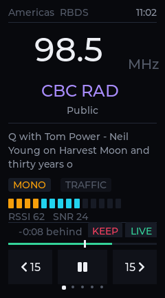
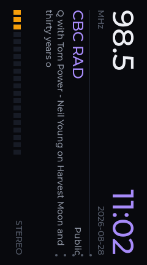
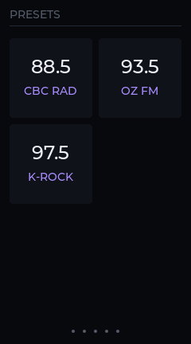
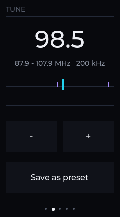
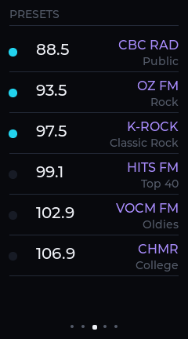
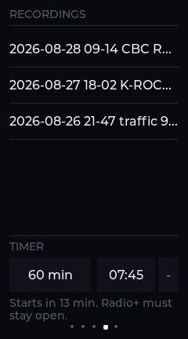
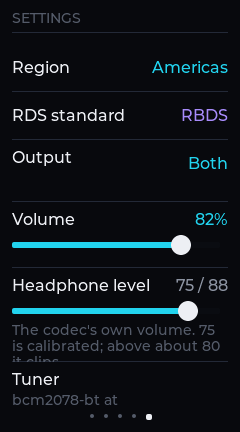
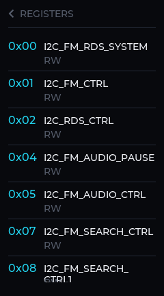
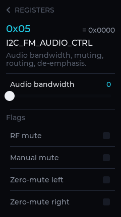
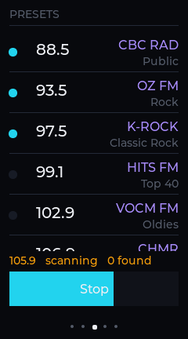

# Radio+

The FM tuner on the iPod nano 7G, with everything the broadcast is already
telling you.

The hardware has had an FM receiver and a full RDS decoder in it since 2012.
RetailOS shows you a frequency. This shows you the station's name, what it is
broadcasting, its programme type, its alternate frequencies, its own clock —
and lets you record any of it, including the part that already happened.

## Screenshots

| | | |
| --- | --- | --- |
|  |  |  |
| Now Playing | Landscape readout | Simple screen |
|  |  |  |
| Dial | Presets | Recordings |
|  |  |  |
| Settings | Register explorer | One register |

Rendered from the host build at the device's exact 240×432 with
`cd host && make -f Makefile.preview shots` — no display, no hardware.

## What it does

### The radio

- **Five region plans.** Americas (RBDS, 200 kHz spacing), Europe, Australia,
  Japan (76–95 MHz) and Japan wide (76–108 MHz). The region sets the band, the
  grid and which programme-type table is in force.
- **Seek and step**, on the region's own grid rather than a fixed 100 kHz.
- **A signal meter that is a shape, not a number.** RSSI is reported across the
  full byte but everything real lives in the bottom third, so the scale is
  compressed to where the signal actually is. You can see whether moving the
  headphone cable helped.

### RDS, properly

Group decoding is IEC 62106 and the NRSC RBDS variant, implemented from the
standard and independent of the tuner chip. Decoded and displayed:

| Group | Carries |
| --- | --- |
| 0A / 0B | Programme service name, traffic flags, music/speech, decoder identification, alternate frequencies |
| 1A | Extended country code, programme item number |
| 2A / 2B | Radio text — 64 characters, or 32 in the B variant |
| 4A | Clock time and date, converted from modified Julian day and offset to local |
| 10A | Programme type name, the eight-character refinement of the numeric type |

**RBDS is not a footnote.** North American broadcasters use a completely
different programme-type table, and `I2C_RDS_CTRL` bit 0 selects which the chip
is decoding. Showing "Serious Classical" for a station transmitting "Classical"
would be a small lie; showing "Phone In" for "Public" is a large one.

A programme service name is shown only once every segment has arrived — a
half-filled name reads as a glitch rather than as a station. Radio text clears
on the A/B flag toggle, or the old message shows through the gaps in the new
one.

### Recording

- **Record what is playing**, to WAV, with an RDS sidecar beside it.
- **Keep what already happened.** A live ring buffer runs behind the radio —
  30 seconds by default, settable — and **KEEP** writes the whole of it to a
  file. That is the reason a timeshift buffer exists, and it is one button.
- **Scrub back into the buffer** and return to live.
- **Traffic announcements can record themselves**, off by default: a radio that
  starts writing files on its own the first time a station announces traffic is
  a surprise, and a surprise that fills a disk.

Recordings are named by date and station rather than `rec001`, because a
directory of `rec001` is useless a week later.

#### The RDS sidecar

Each recording gets a `name.rds.json` beside it, carrying **raw groups**
alongside the decoded fields. Raw groups mean a recording can be decoded again
later by a better decoder than the one that made it — which matters here
specifically, because the FIFO framing in `core/rds.c` is not yet confirmed and
every recording made before it is confirmed would otherwise be undecodable
afterwards.

It is written streaming — opened, appended to, closed — so an hour-long
recording does not have to be held in memory, and each append is a complete
line that stands on its own if the file is truncated.

### Two optional screens

Both are off by default and both add a page to the swipe sequence, which is why
they are a setting: a sequence you have learned should not grow a page because
someone shipped a feature.

**Simple** is six big buttons and nothing else. Not a cut-down Now Playing — a
different answer to a different question. Everything else here is for finding
out what the radio is doing; this is for pressing the station you always press
without reading anything. Which six is your choice, made on the Presets screen,
because the interesting presets are rarely the lowest frequencies.

**Landscape** gives the radio text the whole long edge. Sixty-four characters
is four cramped lines in a 240 px column and two comfortable ones turned
sideways, with the frequency and the station's own clock across the top at the
size you would read across a room. Turn the device counter-clockwise, home
button to the right.

The display is *not* rotated — the framebuffer and the touch mapping are
untouched, and only the items on that screen turn. See
[Rotating without rotating](#rotating-without-rotating).

### The register explorer

All 39 documented tuner registers, field by field, with bitmaps as tick boxes,
enumerations as lists and everything else as a slider. Read-only registers get
their values shown and no controls, because offering a slider that does nothing
is a lie.

A register you change by hand is also **remembered**. The tuner forgets
everything when it powers down, so an override that is not replayed at start-up
lasts only as long as the chip stays on — which would make the explorer a toy
rather than a settings screen. A stereo blend curve tuned once is still there
tomorrow. Overrides are replayed *after* the region, so a region change cannot
silently undo a deliberate override of a register it touches.

## How it is put together

```
model.h        everything the UI draws, in one struct
core/          pure C99, no allocation, no I/O — testable with no hardware
  fmcmd.c        HCI command framing for the tuner
  fmreg.c        the register table, transcribed from the specification
  rds.c          IEC 62106 / RBDS group decoding
  region.c       band plans
  store.c        presets, settings and the sidecar, as JSON
  wav.c          WAV headers, including repairing a streamed one
platform/      one file per target, behind a header core/ never sees
ui.c           every screen, shared by the device and the host preview
```

The screens read `rp_model` and nothing else. That is what lets the whole
interface be rendered on a desktop with no tuner: the host preview fills the
same struct with a plausible station and every screen believes it.

### Rotating without rotating

The landscape screen lays its content out in landscape coordinates and converts
to the portrait framebuffer. Rectangles need no transform at all — a rectangle
turned ninety degrees is still an axis-aligned rectangle with its sides
swapped — so only the labels carry one.

Rotating one full-screen layer instead would need a 432 × 240 × 4 buffer, which
is 414 KB out of a 640 KB LVGL heap. Per-item rotation makes the cost
proportional to the text actually shown.

This needs `LV_DRAW_SW_SUPPORT_ARGB8888`, because LVGL renders a transformed
widget into a layer and a transformed layer needs an alpha format. The shared
`sdk/lv_conf.h` compiles that out — correct for every other screen in the repo,
which is opaque XRGB8888 throughout — and without it `lv_draw_sw_transform.c`
falls through to a default that logs "color format is not enabled" and draws
nothing at all. It is enabled in this app's own config so that one screen in
one app does not grow every app in the repo.

Which is also why **Radio+ builds its own LVGL** rather than sharing Entrain's
archive: it cannot share an archive when it needs a different config. That has
the happy side effect of making this app buildable from a clone of itself.

## Building

### Host preview

Renders every screen to PNG with no display and no hardware.

```bash
cd host && make -f Makefile.preview shots
```

### The device

```bash
cd host && make -f Makefile.n31          # build
cd host && make -f Makefile.n31 push     # send it over
cd host && make -f Makefile.n31 run      # push and run
```

Static against musl, because the device boots a 26 MB initramfs with
essentially no shared libraries.

LVGL objects are cached under `~/.cache/n31-lvgl/` in a directory named for the
hash of the config that produced them. Two reasons: the Windows drive costs more
in filesystem time than the compiler costs in CPU, and `lv_conf` is a tracked
file whose mtime moves on every branch switch even when not one byte of it
changed. `make clean` leaves the cache alone; `make clean-lvgl` drops it.

## Tests

```bash
cd host && make -f Makefile.host test
```

Everything runs with no tuner, no iPod and no Bluetooth stack, which is the
whole reason `core/` has no dependencies. Two kinds of check: that the encoder
produces exactly the bytes the firmware's own framing implies and rejects
malformed events rather than reading past them, and that the register table is
internally consistent — it is transcribed by hand from a specification, and a
typo in a bit offset is otherwise invisible until it is a wrong register write
on real hardware.

## Scanning the band

Filling the preset list by hand means tuning to a station, deciding it is
worth keeping, saving it, and doing that twenty times. **Scan band**, at the
bottom of the Presets screen, does it in about a minute.



Two passes, and the split is what makes it a minute rather than eight.

The **sweep** steps every channel in the region and only asks whether anything
is there. A hundred milliseconds is enough for the signal reading to settle,
so a European band at 100 kHz spacing — 205 channels — takes twenty seconds.

The **naming** pass goes back to the channels that answered yes and waits for
RDS on each. That is seconds, not milliseconds: the station name arrives two
characters at a time, and a weak signal can take several seconds to spell
eight letters. Doing it on every channel would take eight minutes; doing it on
the twenty that have something on them takes one. It also stops waiting the
moment a name is complete, which on a strong station is well under a second.

Committing updates presets that already exist rather than duplicating them, so
a rescan improves the list instead of doubling it — and it leaves the
simple-screen choice alone, because a rescan must not rearrange the screen you
set up.

Cancelling puts the tuner back where it was. So does finishing.

The scan keeps running if you swipe away from the Presets screen. It is
pumped from the frame callback rather than from that screen's refresh, for
exactly that reason: the point of a scan is that you can stop watching it.

The state machine is `core/scan.c` and knows nothing about tuners or screens —
it says which channel it wants to be on and is told what is there. That is
what lets it run identically on the device and in the host preview, and be
tested with neither.

## The recording timer

Two things that share a struct rather than one feature, and the interface
keeps them apart because their reliability is not the same.

A **length** — 5 minutes to 3 hours, or no limit — is dependable. Press
record, say "an hour", walk away. Nothing can go wrong with it that would not
also go wrong with a recording you stopped by hand, because the app is running
the whole time by definition: it is recording.

A **start time** is not dependable and the screen says so. This device has no
real-time wake. Something has to be running to notice the moment arrived, and
that something is Radio+ — on screen or blanked, but never closed. The clock
it reads is the one broadcast in RDS group 4A, so it is only as good as the
station's, it arrives a minute or so after tuning, and a station that does not
send group 4A has no clock at all. With no clock the start never fires and the
note says `Waiting for the station clock` rather than firing at some arbitrary
later moment — a scheduled recording that begins whenever the time eventually
turns up is worse than one that does not begin, because you could not tell
which you got.

Fifteen-minute steps, forward on the button and back on the narrow one beside
it. Arbitrary minutes would need a keyboard this device does not have, and a
quarter of an hour is the granularity broadcast schedules actually use.

When both are set the length wins: a schedule cannot extend a recording past
where it should have stopped.

`core/timer.c` is the whole of it, and it is a pure function of the clock and
the recording state — which is what lets the awkward cases (no clock, the same
minute twice, midnight, tomorrow) be tested without a tuner or a calendar.

## Known limitations

- **The RDS FIFO framing is not confirmed.** How the BCM part frames its FIFO is
  undocumented in the command specification and its Linux driver is not in this
  tree. The one function that guesses at it is isolated at the bottom of
  `core/rds.c` and named so nobody mistakes it for established fact. Group
  decoding above it is verifiable against the standard and tested with no
  hardware. This is also why the sidecar stores raw groups.
- **Presets cannot be renamed or reordered** from the list. Renaming would
  need an on-screen keyboard, and RDS fills the name in by itself on any
  station that broadcasts one, which is most of them.
- **The landscape screen is unverified on hardware** at the time of writing —
  it is verified in the host preview, which renders at the device's exact
  geometry, but not yet on a panel.
- **Storage is optional and that is deliberate.** Settings, presets and
  recordings live under `RADIOPLUS_HOME`; with no volume mounted the app starts
  anyway and simply has nothing saved to load.

## Licence

Same as the rest of the repository.
